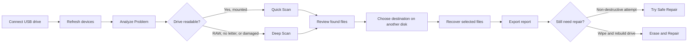

# Pendrive Rescue

<p align="center">
  
</p>

<h3 align="center">A Windows recovery assistant for USB flash drives.</h3>

<p align="center">
  <a href="https://dotnet.microsoft.com/download/dotnet/8.0"></a>
  
  
</p>

Pendrive Rescue helps you inspect, scan, and recover files from USB flash drives before attempting repair. The app is designed around one rule: recover data first, repair later.

It can detect removable drives, diagnose common USB problems, run quick scans on mounted drives, run deep raw scans on damaged or RAW devices, recover selected files to another disk, export JSON reports, and optionally try repair actions when recovery is complete.

## Contents

- [How It Works](#how-it-works)
- [Safety Model](#safety-model)
- [How To Use The App](#how-to-use-the-app)
- [Requirements](#requirements)
- [Build And Run](#build-and-run)
- [Testing](#testing)
- [Project Structure](#project-structure)
- [Publishing](#publishing)
- [Support The Project](#support-the-project)

## How It Works

Pendrive Rescue is a layered .NET 8 Windows desktop application:

| Layer | Responsibility |
| --- | --- |
| `PendriveRescue.App` | WPF interface, commands, progress, folder picking, startup wiring, and logging. |
| `PendriveRescue.Application` | Use cases that coordinate scans, recovery, diagnostics, repair, and report export. |
| `PendriveRescue.Domain` | Shared entities, enums, and service contracts. |
| `PendriveRescue.Infrastructure` | Windows device detection, raw reads, file carving, recovery, DiskPart/CHKDSK repair, and JSON reports. |
| `PendriveRescue.Tests` | xUnit tests for scanning, recovery, diagnostics, and repair services. |

### Main Workflow



### Scan Types

| Feature | Use When | What It Does |
| --- | --- | --- |
| Analyze Problem | You are not sure what is wrong with the pendrive. | Checks device health signals and recommends the safest next step. |
| Quick Scan | The drive has a letter and Windows can read it. | Searches the mounted filesystem for recoverable files. |
| Deep Scan | The drive is RAW, inaccessible, has no drive letter, or looks corrupted. | Reads the physical device in raw mode and carves files by known signatures. |
| Recover Files | Scan results are available. | Copies selected files to a destination folder on another drive. |
| Export Report | After a scan or recovery job. | Saves a JSON report with scan/recovery details. |
| Try Safe Repair | You already recovered important files and want a non-destructive repair attempt. | May clear read-only flags, assign a drive letter, and run CHKDSK when possible. |
| Erase and Repair | You no longer need data from the pendrive. | Destructively recreates and formats the USB drive. |

### File Types Recognized By Deep Scan

The current file signature database includes common formats such as:

- JPG, PNG
- PDF
- DOCX, XLSX, PPTX
- ZIP
- MP4, MP3
- UTF-8 BOM text files

## Safety Model

Pendrive Rescue is intentionally cautious:

- Scanning and recovery do not write to the source pendrive.
- Recovery blocks saving files back onto the same source drive letter.
- Deep Scan reads physical devices in read-only mode.
- Destination space is checked before selected files are recovered.
- Safe Repair is intended to avoid formatting, but CHKDSK may still modify filesystem metadata.
- Erase and Repair is destructive and requires explicit confirmation.

Recommended order:

1. Diagnose the USB drive.
2. Scan for recoverable files.
3. Recover files to a different physical disk.
4. Verify the recovered files.
5. Export a report.
6. Try repair only after important files are safe.

## How To Use The App

1. Run Pendrive Rescue on Windows.
2. Connect the USB flash drive.
3. Press **Refresh** if the drive is not listed.
4. Select the pendrive from the **Devices** panel.
5. Press **Analyze Problem** to get a recommendation.
6. Use **Quick Scan** if the device is mounted and readable.
7. Use **Deep Scan** if the device is RAW, inaccessible, missing a drive letter, or unhealthy.
8. Select the files you want to recover.
9. Choose a destination folder on another drive.
10. Press **Recover to Destination** or **Recover Files...**.
11. Use **Export Report** to save a JSON recovery or scan report.
12. Only after recovery, use **Try Safe Repair** or **Erase and Repair** if needed.

> Important: run the app as Administrator when using raw disk reads, Deep Scan on physical devices, DiskPart repair, or CHKDSK repair.

## Requirements

- Windows 10 or Windows 11
- .NET 8 SDK for development
- Administrator privileges for raw disk access and repair operations

## Build And Run

Restore and build the solution:

```powershell
dotnet restore PendriveRescue.sln
dotnet build PendriveRescue.sln
```

Run the app from the command line:

```powershell
dotnet run --project src\PendriveRescue.App\PendriveRescue.App.csproj
```

Or open the solution in Visual Studio and set `PendriveRescue.App` as the startup project.

If a local build fails with file-locking behavior but no useful compiler errors, build with one worker:

```powershell
dotnet build PendriveRescue.sln --no-restore -maxcpucount:1
```

If restore fails because the user-level NuGet config cannot be read, check access to:

```text
%AppData%\NuGet\NuGet.Config
```

The solution may still compile with existing restored assets:

```powershell
dotnet build PendriveRescue.sln --no-restore
```

## Testing

Run the test suite:

```powershell
dotnet test PendriveRescue.sln
```

For already-restored dependencies:

```powershell
dotnet test PendriveRescue.sln --no-restore
```

If the test project fails because of local file locking, use:

```powershell
dotnet test PendriveRescue.sln --no-restore -maxcpucount:1
```

## Project Structure

```text
src/
  PendriveRescue.App/             WPF desktop UI and dependency injection
  PendriveRescue.Application/     Use-case orchestration
  PendriveRescue.Domain/          Entities, enums, and contracts
  PendriveRescue.Infrastructure/  Device access, scanning, recovery, repair, reports
tests/
  PendriveRescue.Tests/           xUnit coverage for core behavior
```

Logs are written under:

```text
%LocalAppData%\PendriveRescue\logs
```

## Publishing

Do not publish during normal development unless you intentionally need a distributable build.

Create a single self-contained Windows build:

```powershell
dotnet publish src\PendriveRescue.App\PendriveRescue.App.csproj -c Release -r win-x64 --self-contained true
```

Avoid creating multiple executable variants from ad-hoc local changes.

## Support The Project

If Pendrive Rescue helps you recover files or saves you time, you can support future development through PayPal:

<p align="center">
  <a href="https://www.paypal.com/ncp/payment/BTHPUL5GTRH9G">
    
  </a>
</p>

Direct support link:

```text
https://www.paypal.com/ncp/payment/BTHPUL5GTRH9G
```

GitHub README files do not run JavaScript, so the visual button above uses a normal link. If you are embedding the PayPal hosted button on a website that allows scripts, use this snippet:

<details>
<summary>PayPal hosted button HTML</summary>

```html
<script
  src="https://www.paypal.com/sdk/js?client-id=BAAScGQyx_vaLmg6hI1P22brsfofGYQh9sGJuQFEZMVqok17XqKdNSz0c5dP0hw7ahsK0qUiSE0weESMZU&components=hosted-buttons&disable-funding=venmo&currency=USD">
</script>

<div id="paypal-container-BTHPUL5GTRH9G"></div>
<script>
  paypal.HostedButtons({
    hostedButtonId: "BTHPUL5GTRH9G",
  }).render("#paypal-container-BTHPUL5GTRH9G")
</script>
```

</details>
