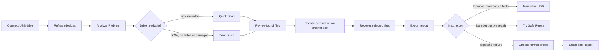

# Pendrive Rescue

<p align="center">
  
</p>

<h3 align="center">A Windows recovery assistant for USB flash drives.</h3>

<p align="center">
  <a href="https://dotnet.microsoft.com/download/dotnet/8.0"></a>
  
  
</p>

Pendrive Rescue helps you inspect, recover, normalize, protect, and repair USB flash drives. The app is designed around one rule: recover data first, repair later.

It can diagnose removable drives, run mounted and raw scans, recover files to another disk, clean common shortcut-virus artifacts, quarantine suspicious launchers, run Microsoft Defender, rebuild damaged flash drives, and prepare FAT32 media for printers and other embedded devices.

## Contents

- [How It Works](#how-it-works)
- [Safety Model](#safety-model)
- [How To Use The App](#how-to-use-the-app)
- [USB Security](#usb-security)
- [Printer And Device Compatibility](#printer-and-device-compatibility)
- [Requirements](#requirements)
- [Build And Run](#build-and-run)
- [Testing](#testing)
- [Project Structure](#project-structure)
- [Publishing](#publishing)
- [Support The Project](#support-the-project)

## How It Works

Pendrive Rescue is a layered .NET 8 Windows desktop application:

| Layer | Responsibility |
| --- | --- |
| `PendriveRescue.App` | WPF interface, commands, progress, folder picking, startup wiring, and logging. |
| `PendriveRescue.Application` | Use cases that coordinate scans, recovery, diagnostics, repair, and report export. |
| `PendriveRescue.Domain` | Shared entities, enums, and service contracts. |
| `PendriveRescue.Infrastructure` | Windows device detection, raw reads, file carving, recovery, DiskPart/CHKDSK repair, and JSON reports. |
| `PendriveRescue.Tests` | xUnit tests for scanning, recovery, diagnostics, and repair services. |

### Main Workflow



### Scan Types

| Feature | Use When | What It Does |
| --- | --- | --- |
| Analyze Problem | You are not sure what is wrong with the pendrive. | Revalidates the physical USB, gathers read-only disk, partition, volume, bounded-read, and security evidence, then explains the likely condition, confidence, severity, limitations, and safest next steps. |
| Quick Scan | The drive has a letter and Windows can read it. | Searches the mounted filesystem for recoverable files. |
| Deep Scan | The drive is RAW, inaccessible, has no drive letter, or looks corrupted. | Reads the physical device in raw mode and carves files by known signatures. |
| Recover Files | Scan results are available. | Copies selected files to a destination folder on another drive. |
| Export Report | After an analysis, scan, or recovery job. | Saves a privacy-safe JSON report with diagnostic findings or scan/recovery details. |
| Normalize USB | Files are hidden or the drive contains shortcut-virus artifacts. | Restores attributes, quarantines scripts and launchers off the USB, preserves Windows metadata, and can run Defender before and after cleanup. |
| Microsoft Defender | The USB may have been connected to an infected computer. | Runs a computer Quick Scan or a custom scan of the selected USB without launching files from it. |
| AutoRun blocker | You want a basic additional barrier against older AutoRun techniques. | Occupies the `autorun.inf` path. It does not stop malware already running on a computer. |
| Try Safe Repair | You already recovered important files and want a non-destructive repair attempt. | May clear read-only flags, assign a drive letter, and run CHKDSK when possible. |
| Erase and Repair | You no longer need data from the pendrive. | Destructively creates one MBR partition using the selected exFAT or FAT32 profile. |

Analyze is read-only and never starts scans, recovery, CHKDSK, formatting, cleanup, or repair automatically. Missing evidence remains explicitly unknown, and an unavailable low-level check produces an incomplete diagnosis instead of being treated as proof that the USB is healthy or physically damaged. The analysis panel keeps multiple findings visible, orders recommendations by safety, disables unsafe actions, and can export the same stable diagnostic codes shown on screen.

### File Types Recognized By Deep Scan

The current file signature database includes common formats such as:

- JPG, PNG
- PDF
- DOCX, XLSX, PPTX
- ZIP
- MP4, MP3
- UTF-8 BOM text files

## Safety Model

Pendrive Rescue is intentionally cautious:

- Scanning and recovery do not write to the source pendrive.
- Recovery blocks saving files back onto the same source drive letter.
- Deep Scan reads physical devices in read-only mode.
- Destination space is checked before selected files are recovered.
- Safe Repair is intended to avoid formatting, but CHKDSK may still modify filesystem metadata.
- Erase and Repair is destructive and requires explicit confirmation.
- Repair follows the same physical disk if Windows changes its drive letter.
- Suspicious cleanup items are copied to an off-USB quarantine and SHA-256 verified before the source is removed.
- `System Volume Information` and `$RECYCLE.BIN` are treated as Windows metadata and kept hidden.
- Filesystem links are not followed during recursive USB cleanup.

Recommended order:

1. Diagnose the USB drive.
2. Scan for recoverable files.
3. Recover files to a different physical disk.
4. Verify the recovered files.
5. Export a report.
6. Try repair only after important files are safe.

## How To Use The App

1. Run Pendrive Rescue on Windows.
2. Connect the USB flash drive.
3. Press **Refresh** if the drive is not listed.
4. Select the pendrive from the **Devices** panel.
5. Press **Analyze Problem** to get a recommendation.
6. Use **Quick Scan** if the device is mounted and readable.
7. Use **Deep Scan** if the device is RAW, inaccessible, missing a drive letter, or unhealthy.
8. Select the files you want to recover.
9. Choose a destination folder on another drive.
10. Press **Recover to Destination** or **Recover Files...**.
11. Use **Export Report** to save a JSON recovery or scan report.
12. Use **Normalize USB** to clean shortcut-virus artifacts while keeping personal files.
13. Only after recovery, use **Try Safe Repair** or **Erase and Repair** if needed.
14. Before **Erase and Repair**, choose **Full capacity (exFAT)** or **Printers / devices (FAT32)**.

> Important: run the app as Administrator when using raw disk reads, Deep Scan on physical devices, DiskPart repair, or CHKDSK repair.

## USB Security

Normalize can combine heuristic cleanup with Microsoft Defender:

1. Resolve the currently mounted letter for the selected physical USB.
2. Run a Defender Quick Scan of the computer.
3. Scan the USB before cleanup.
4. Restore hidden personal files and quarantine suspicious scripts, shortcuts, and launchers.
5. Scan the USB again.
6. Apply the optional AutoRun blocker only when cleanup and the final scan do not require action.

Quarantined files are stored under:

```text
%LocalAppData%\PendriveRescue\quarantine
```

Each quarantine session includes a JSON manifest with the original path, quarantined path, SHA-256 hash, reason, and timestamp.

No writable USB can defend itself completely from a computer that is already infected. Use a clean computer, keep endpoint antivirus active, and use hardware write protection when the drive supports it.

## Printer And Device Compatibility

Many printers, televisions, car audio systems, and other embedded devices do not support exFAT even when Windows does. Compatibility is model-specific: for example, [HP documents FAT12/FAT16/FAT32 support for several LaserJet Pro models](https://support.hp.com/in-en/document/ish_6747435-6747479-16), while [some Epson models require FAT32 and one partition](https://files.support.epson.com/docid/cpd5/cpd54920/source/pro_graphics/source/printing_device/reference/usb_memory_requirements.html). Some newer [Canon models support FAT32 and exFAT](https://downloads.canon.com/iRADV_C3330i_Manual/contents/1T0002897646.html).

Pendrive Rescue provides two destructive repair profiles:

| Profile | Layout | Best For | Tradeoffs |
| --- | --- | --- | --- |
| Full capacity (exFAT) | One MBR/exFAT partition using the full drive | Windows, macOS, and modern equipment | Older printers and embedded devices may not recognize it. |
| Printers / devices (FAT32) | One MBR/FAT32 partition | Printers, TVs, projectors, and car audio | FAT32 files cannot exceed 4 GB. Drives larger than 32 GB use a conservative 30,000 MB partition; remaining space is unallocated. |

The compatibility profile uses Windows DiskPart and the supported FAT32 format path described by [Microsoft's format documentation](https://learn.microsoft.com/en-us/windows-server/administration/windows-commands/format). A device can still reject a USB because of its capacity, logical sector size, connector requirements, supported file types, folder rules, or firmware.

**Normalize does not change the filesystem or partition layout.** An exFAT USB remains exFAT after Normalize. To convert it for an older printer, recover any required files and use **Erase and Repair** with **Printers / devices (FAT32)**.

After repair, Windows may temporarily remove the old drive letter and assign another one. Pendrive Rescue waits for the same physical disk to remount and updates the selected letter automatically. If mounting takes longer than 30 seconds, reconnect the USB or press **Refresh** before continuing.

## Requirements

- Windows 10 or Windows 11
- .NET 8 SDK for development
- Administrator privileges for raw disk access and repair operations

## Build And Run

Restore and build the solution:

```powershell
dotnet restore PendriveRescue.sln
dotnet build PendriveRescue.sln
```

Run the app from the command line:

```powershell
dotnet run --project src\PendriveRescue.App\PendriveRescue.App.csproj
```

Or open the solution in Visual Studio and set `PendriveRescue.App` as the startup project.

If a local build fails with file-locking behavior but no useful compiler errors, build with one worker:

```powershell
dotnet build PendriveRescue.sln --no-restore -maxcpucount:1
```

If restore fails because the user-level NuGet config cannot be read, check access to:

```text
%AppData%\NuGet\NuGet.Config
```

The solution may still compile with existing restored assets:

```powershell
dotnet build PendriveRescue.sln --no-restore
```

## Testing

Run the test suite:

```powershell
dotnet test PendriveRescue.sln
```

For already-restored dependencies:

```powershell
dotnet test PendriveRescue.sln --no-restore
```

If the test project fails because of local file locking, use:

```powershell
dotnet test PendriveRescue.sln --no-restore -maxcpucount:1
```

## Project Structure

```text
src/
  PendriveRescue.App/             WPF desktop UI and dependency injection
  PendriveRescue.Application/     Use-case orchestration
  PendriveRescue.Domain/          Entities, enums, and contracts
  PendriveRescue.Infrastructure/  Device access, scanning, recovery, repair, reports
tests/
  PendriveRescue.Tests/           xUnit coverage for core behavior
```

Logs are written under:

```text
%LocalAppData%\PendriveRescue\logs
```

## Publishing

Do not publish during normal development unless you intentionally need a distributable build.

Create the framework-dependent single-file Windows build used by the principal executable:

```powershell
dotnet publish src\PendriveRescue.App\PendriveRescue.App.csproj -c Release -r win-x64 --self-contained false -p:PublishSingleFile=true -o publish-updated
```

Avoid creating multiple executable variants from ad-hoc local changes.

## Support The Project

If Pendrive Rescue helps you recover files or saves you time, you can support future development through PayPal:

<p align="center">
  <a href="https://www.paypal.com/ncp/payment/BTHPUL5GTRH9G">
    
  </a>
</p>

Direct support link:

```text
https://www.paypal.com/ncp/payment/BTHPUL5GTRH9G
```

GitHub README files do not run JavaScript, so the visual button above uses a normal link. If you are embedding the PayPal hosted button on a website that allows scripts, use this snippet:

<details>
<summary>PayPal hosted button HTML</summary>

```html
<script
  src="https://www.paypal.com/sdk/js?client-id=BAAScGQyx_vaLmg6hI1P22brsfofGYQh9sGJuQFEZMVqok17XqKdNSz0c5dP0hw7ahsK0qUiSE0weESMZU&components=hosted-buttons&disable-funding=venmo&currency=USD">
</script>

<div id="paypal-container-BTHPUL5GTRH9G"></div>
<script>
  paypal.HostedButtons({
    hostedButtonId: "BTHPUL5GTRH9G",
  }).render("#paypal-container-BTHPUL5GTRH9G")
</script>
```

</details>
